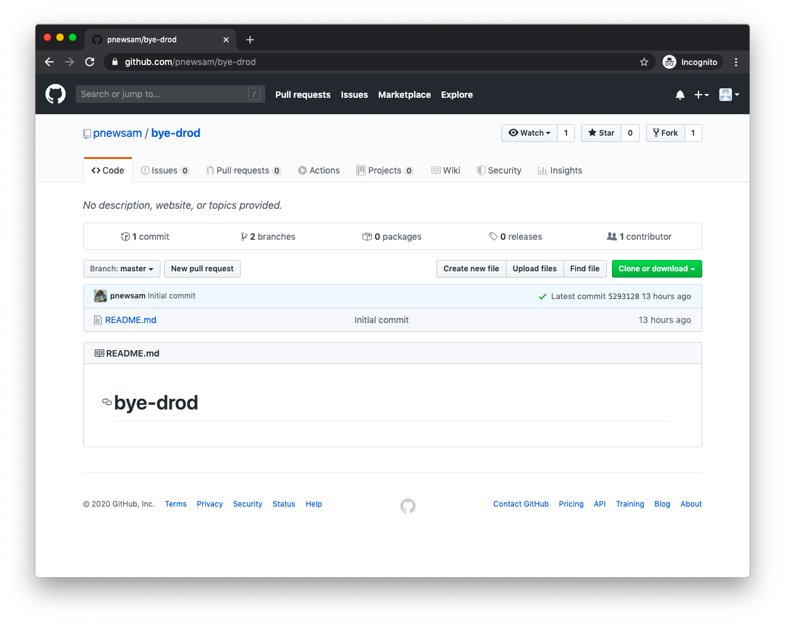
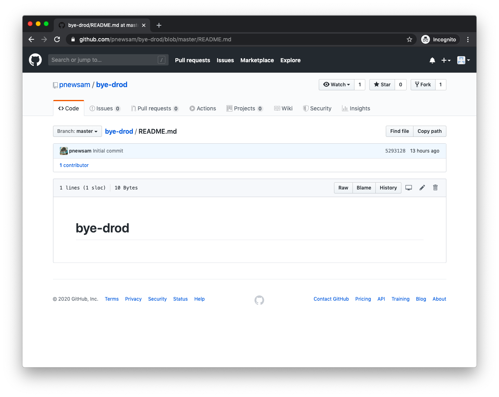
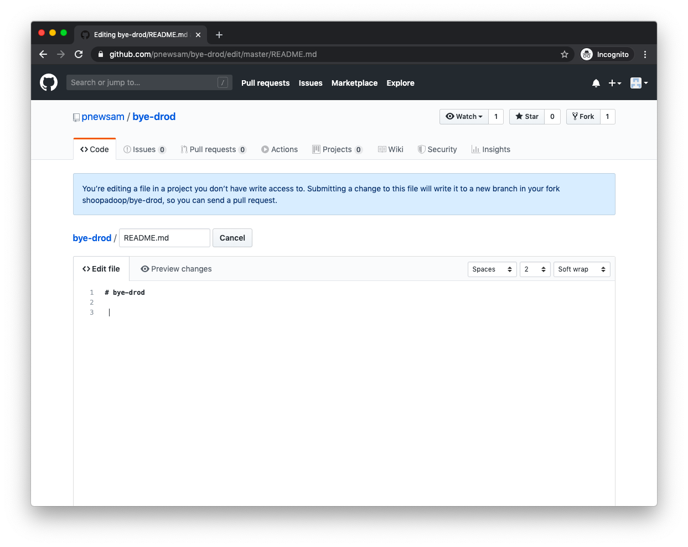
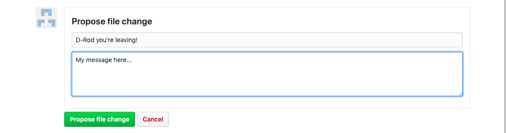
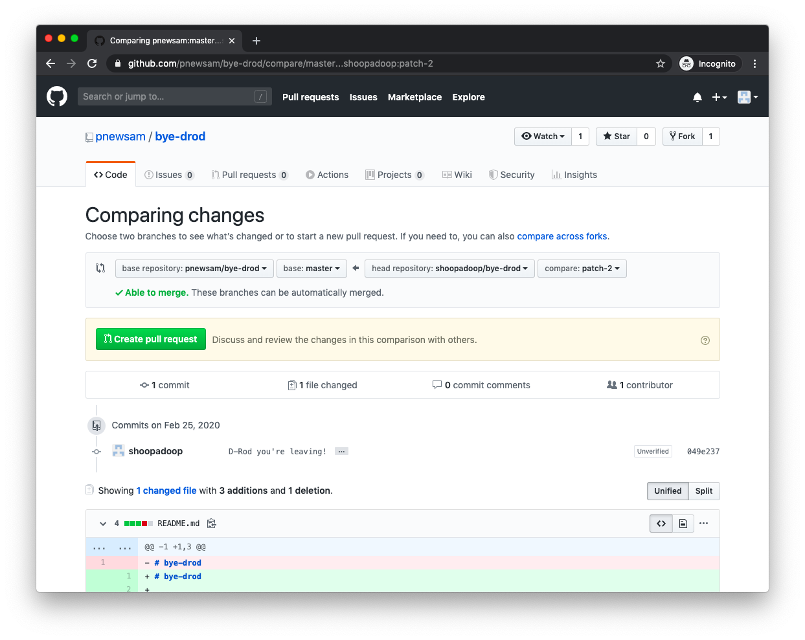
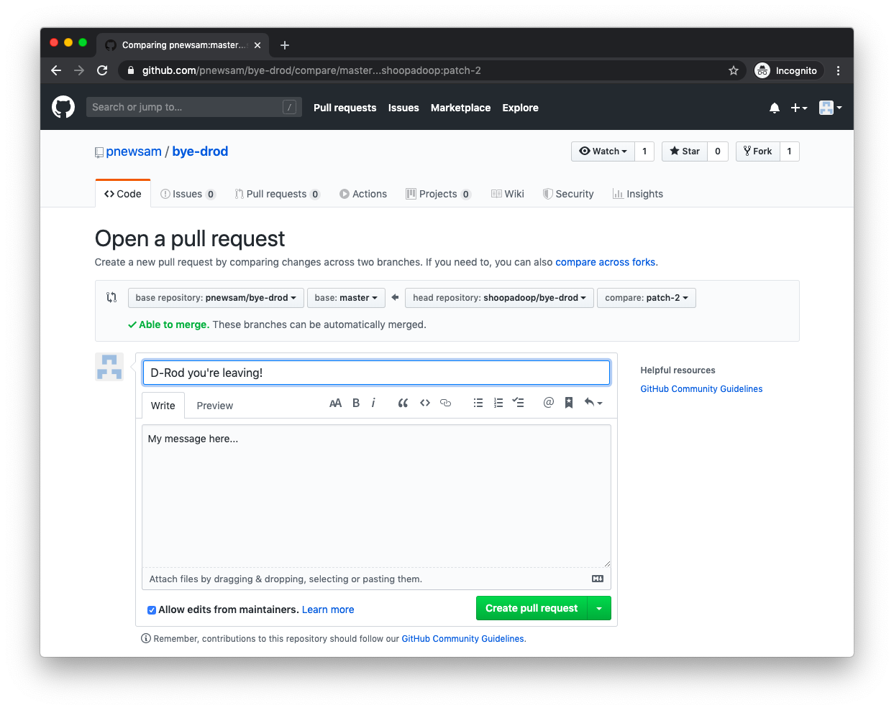

 See the Website (as yet): https://pnewsam.github.io/bye-drod/
 
# byedrod

# Instructions

1. Submit a PR with some inconsequential change (add/remove a space) and leave your farewell message in 
the git commit. That's it!

Many people have been running into this error if they git clone then try pushing up a branch:
```
remote: Permission to pnewsam/bye-drod.git denied to UserNameHere.
fatal: unable to access 'https://github.com/pnewsam/bye-drod.git/': The requested URL returned error: 403
```

If you do, you may need to follow these steps (fork, clone, push, create PR): https://stackoverflow.com/a/17857453
You may also need to be added as a collaborator. Ping me if so.

2. (Optional) Make edits to the website! Anything is welcome. Encouraged are: words of inspiration or heartfelt 
emotion, memes, pictures of D-Rod or things he likes, head-scratching haikus, marquees and other reminders of 
early HTML, unnecessary animations, unnecessary assets, insidious or mischievious scripts (but not too insidious, 
plox). Everything is FAIR GAME! I will ship anything as soon as I see it -- I'll ping you if you have merge 
conflicts but please resolve them yourself 🙏🏼!

## **IMPORTANT! IF YOU ARE NOT DEVELOPER/HAVE NOT USED GIT BEFORE:**
 
You can still submit a PR! PLEASE DO! (It will take 5 minutes.) D-Rod is a teacher and he would love love love 
seeing commits from non- (aka. fledgling) developers 🙂. Here's how:

1. Create a Github account at https://github.com. (Straightforward, but reach out to me if you need assistance! You 
just need to provide an email.)

2. Visit the repo at https://github.com/pnewsam/bye-drod and click on the "README.md" file.
 

3. Click the edit icon to "Edit the file in your fork of this project".


4. Add or remove a space ANYWHERE in the file editor.


5. Scroll down. Under "Propose file change" fill out the two fields: for a *subject* and a *message*. This is 
your farewell message!!!


6. Click the green button 3 times - "Propose file change" ☝🏼, then "Create pull request" 👇🏼, then "Create 
pull request" 👇🏼👇🏼 again!



7. That's it! I will merge your PR.

## At the End of All Things:

I will drop all merge commits to polish up the git history. Then we'll print out the git log and present it to D-Rod, along with any other gifts we may have slash any bud lights ready to hand. 

## FEEL FREE TO ADD/REMOVE EMPTY SPACES HERE!!! 👇🏼

  
  
